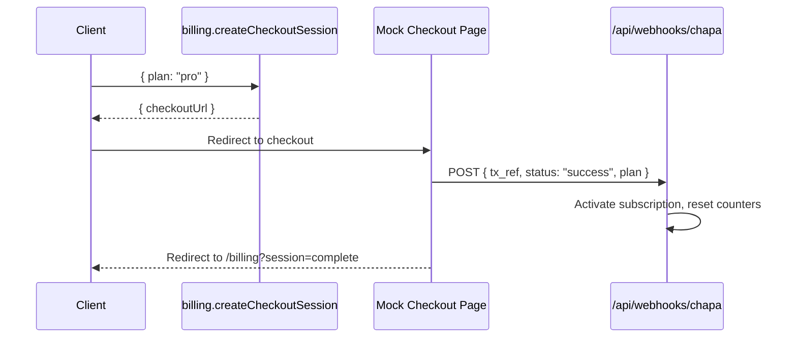

# Phase 2 Walkthrough — Ethiopian Market Pricing Strategy

## Summary

Phase 2 is **complete**. The Estate IQ backend now enforces a 14-day trial-first model, gates all write operations behind an active subscription, enforces per-tier resource limits, and provides a mock Chapa checkout flow for testing the full payment-to-activation lifecycle.

---

## Changes Made

### 1. Database Schema (`drizzle/schema.ts`)

- **Enum update**: `plan` enum changed from `["starter", "pro", "scale"]` → `["starter", "pro", "agency"]`
- **New fields** added to `workspaces`:
  - `usageCyclePeriodStart` — tracks when the current billing cycle started
  - `aiCaptionsCount` — monthly AI caption usage counter
  - `aiImagesCount` — monthly AI image usage counter

```diff:schema.ts
import { int, mysqlEnum, mysqlTable, text, timestamp, varchar, json, decimal, boolean } from "drizzle-orm/mysql-core";

/**
 * Core user table backing auth flow.
 * Extend this file with additional tables as your product grows.
 * Columns use camelCase to match both database fields and generated types.
 */
export const users = mysqlTable("users", {
  /**
   * Surrogate primary key. Auto-incremented numeric value managed by the database.
   * Use this for relations between tables.
   */
  id: int("id").autoincrement().primaryKey(),
  /** Manus OAuth identifier (openId) returned from the OAuth callback. Unique per user. */
  openId: varchar("openId", { length: 64 }).notNull().unique(),
  name: text("name"),
  email: varchar("email", { length: 320 }),
  phone: varchar("phone", { length: 32 }),
  loginMethod: varchar("loginMethod", { length: 64 }),
  role: mysqlEnum("role", ["user", "admin", "agent", "team_member"]).default("user").notNull(),
  companyName: varchar("companyName", { length: 255 }),
  workspaceId: int("workspaceId"),
  onboardingCompleted: boolean("onboardingCompleted").default(false).notNull(),
  targetMarket: varchar("targetMarket", { length: 255 }),
  selectedPlatforms: json("selectedPlatforms"),
  notificationPreferences: json("notificationPreferences"),
  createdAt: timestamp("createdAt").defaultNow().notNull(),
  updatedAt: timestamp("updatedAt").defaultNow().onUpdateNow().notNull(),
  lastSignedIn: timestamp("lastSignedIn").defaultNow().notNull(),
});

export type User = typeof users.$inferSelect;
export type InsertUser = typeof users.$inferInsert;

export const workspaces = mysqlTable("workspaces", {
  id: int("id").autoincrement().primaryKey(),
  ownerUserId: int("ownerUserId").notNull(),
  name: varchar("name", { length: 255 }).notNull(),
  plan: mysqlEnum("plan", ["starter", "pro", "scale"]).default("starter").notNull(),
  subscriptionStatus: mysqlEnum("subscriptionStatus", ["trial", "active", "past_due", "canceled"]).default("trial").notNull(),
  trialEndsAt: timestamp("trialEndsAt"),
  currentPeriodEndsAt: timestamp("currentPeriodEndsAt"),
  createdAt: timestamp("createdAt").defaultNow().notNull(),
  updatedAt: timestamp("updatedAt").defaultNow().onUpdateNow().notNull(),
});

export type Workspace = typeof workspaces.$inferSelect;
export type InsertWorkspace = typeof workspaces.$inferInsert;

// Contacts table for buyers and sellers
export const contacts = mysqlTable("contacts", {
  id: int("id").autoincrement().primaryKey(),
  userId: int("userId").notNull(),
  workspaceId: int("workspaceId").notNull(),
  firstName: varchar("firstName", { length: 100 }).notNull(),
  lastName: varchar("lastName", { length: 100 }).notNull(),
  email: varchar("email", { length: 320 }),
  phone: varchar("phone", { length: 20 }),
  whatsappNumber: varchar("whatsappNumber", { length: 20 }),
  type: mysqlEnum("type", ["buyer", "seller", "both"]).notNull(),
  status: mysqlEnum("status", ["active", "inactive", "converted", "lost"]).default("active"),
  source: varchar("source", { length: 100 }),
  tags: json("tags"),
  customFields: json("customFields"),
  notes: text("notes"),
  createdAt: timestamp("createdAt").defaultNow().notNull(),
  updatedAt: timestamp("updatedAt").defaultNow().onUpdateNow().notNull(),
});

export type Contact = typeof contacts.$inferSelect;
export type InsertContact = typeof contacts.$inferInsert;

// Properties table
export const properties = mysqlTable("properties", {
  id: int("id").autoincrement().primaryKey(),
  userId: int("userId").notNull(),
  workspaceId: int("workspaceId").notNull(),
  title: varchar("title", { length: 255 }).notNull(),
  description: text("description"),
  address: varchar("address", { length: 255 }).notNull(),
  city: varchar("city", { length: 100 }).notNull(),
  subcity: varchar("subcity", { length: 100 }),
  latitude: decimal("latitude", { precision: 10, scale: 8 }),
  longitude: decimal("longitude", { precision: 11, scale: 8 }),
  price: decimal("price", { precision: 15, scale: 2 }),
  bedrooms: int("bedrooms"),
  bathrooms: int("bathrooms"),
  squareFeet: decimal("squareFeet", { precision: 12, scale: 2 }),
  photos: json("photos"),
  status: mysqlEnum("status", ["available", "sold", "rented", "pending"]).default("available"),
  createdAt: timestamp("createdAt").defaultNow().notNull(),
  updatedAt: timestamp("updatedAt").defaultNow().onUpdateNow().notNull(),
});

export type Property = typeof properties.$inferSelect;
export type InsertProperty = typeof properties.$inferInsert;

// Deals table for tracking the sales pipeline
export const deals = mysqlTable("deals", {
  id: int("id").autoincrement().primaryKey(),
  userId: int("userId").notNull(),
  workspaceId: int("workspaceId").notNull(),
  contactId: int("contactId").notNull(),
  propertyId: int("propertyId"),
  leadId: int("leadId"),
  stage: mysqlEnum("stage", ["lead", "contacted", "viewing", "offer", "closed"]).default("lead"),
  value: decimal("value", { precision: 15, scale: 2 }),
  commission: decimal("commission", { precision: 15, scale: 2 }),
  notes: text("notes"),
  documents: json("documents"),
  createdAt: timestamp("createdAt").defaultNow().notNull(),
  updatedAt: timestamp("updatedAt").defaultNow().onUpdateNow().notNull(),
  closedAt: timestamp("closedAt"),
});

export type Deal = typeof deals.$inferSelect;
export type InsertDeal = typeof deals.$inferInsert;

// Leads table for tracking lead sources
export const leads = mysqlTable("leads", {
  id: int("id").autoincrement().primaryKey(),
  userId: int("userId").notNull(),
  workspaceId: int("workspaceId").notNull(),
  contactId: int("contactId"),
  propertyId: int("propertyId"),
  convertedDealId: int("convertedDealId"),
  source: mysqlEnum("source", ["form", "whatsapp", "facebook", "instagram", "tiktok", "manual"]).notNull(),
  leadData: json("leadData"),
  status: mysqlEnum("status", ["new", "contacted", "qualified", "converted", "lost"]).default("new"),
  score: int("score").default(0),
  createdAt: timestamp("createdAt").defaultNow().notNull(),
  updatedAt: timestamp("updatedAt").defaultNow().onUpdateNow().notNull(),
});

export type Lead = typeof leads.$inferSelect;
export type InsertLead = typeof leads.$inferInsert;

// Brand Kits table
export const brandKits = mysqlTable("brandKits", {
  id: int("id").autoincrement().primaryKey(),
  userId: int("userId").notNull(),
  workspaceId: int("workspaceId").notNull(),
  name: varchar("name", { length: 255 }).notNull(),
  logos: json("logos"),
  colors: json("colors"),
  fonts: json("fonts"),
  createdAt: timestamp("createdAt").defaultNow().notNull(),
  updatedAt: timestamp("updatedAt").defaultNow().onUpdateNow().notNull(),
});

export type BrandKit = typeof brandKits.$inferSelect;
export type InsertBrandKit = typeof brandKits.$inferInsert;

// Designs table for storing design studio creations
export const designs = mysqlTable("designs", {
  id: int("id").autoincrement().primaryKey(),
  userId: int("userId").notNull(),
  workspaceId: int("workspaceId").notNull(),
  type: mysqlEnum("type", ["poster", "instagram", "flyer", "reel", "email", "other"]).notNull(),
  name: varchar("name", { length: 255 }).notNull(),
  template: varchar("template", { length: 255 }),
  content: json("content"),
  previewUrl: varchar("previewUrl", { length: 500 }),
  createdAt: timestamp("createdAt").defaultNow().notNull(),
  updatedAt: timestamp("updatedAt").defaultNow().onUpdateNow().notNull(),
});

export type Design = typeof designs.$inferSelect;
export type InsertDesign = typeof designs.$inferInsert;

// Social Media Posts table
export const socialMediaPosts = mysqlTable("socialMediaPosts", {
  id: int("id").autoincrement().primaryKey(),
  userId: int("userId").notNull(),
  workspaceId: int("workspaceId").notNull(),
  designId: int("designId"),
  platforms: json("platforms"),
  scheduledTime: timestamp("scheduledTime"),
  content: text("content"),
  status: mysqlEnum("status", ["draft", "scheduled", "queued", "publishing", "published", "failed"]).default("draft"),
  platformStatuses: json("platformStatuses"),
  providerMetadata: json("providerMetadata"),
  engagementMetrics: json("engagementMetrics"),
  createdAt: timestamp("createdAt").defaultNow().notNull(),
  updatedAt: timestamp("updatedAt").defaultNow().onUpdateNow().notNull(),
  publishedAt: timestamp("publishedAt"),
});

export type SocialMediaPost = typeof socialMediaPosts.$inferSelect;
export type InsertSocialMediaPost = typeof socialMediaPosts.$inferInsert;

// Engagement Metrics table
export const engagementMetrics = mysqlTable("engagementMetrics", {
  id: int("id").autoincrement().primaryKey(),
  postId: int("postId").notNull(),
  platform: varchar("platform", { length: 50 }).notNull(),
  likes: int("likes").default(0),
  comments: int("comments").default(0),
  shares: int("shares").default(0),
  impressions: int("impressions").default(0),
  clicks: int("clicks").default(0),
  leads: int("leads").default(0),
  timestamp: timestamp("timestamp").defaultNow().notNull(),
});

export type EngagementMetric = typeof engagementMetrics.$inferSelect;
export type InsertEngagementMetric = typeof engagementMetrics.$inferInsert;

export const notifications = mysqlTable("notifications", {
  id: int("id").autoincrement().primaryKey(),
  userId: int("userId").notNull(),
  workspaceId: int("workspaceId").notNull(),
  type: mysqlEnum("type", ["lead", "deal", "engagement", "supplier", "match", "system"]).notNull(),
  title: varchar("title", { length: 255 }).notNull(),
  message: text("message").notNull(),
  entityType: varchar("entityType", { length: 64 }),
  entityId: int("entityId"),
  isRead: boolean("isRead").default(false).notNull(),
  createdAt: timestamp("createdAt").defaultNow().notNull(),
});

export type Notification = typeof notifications.$inferSelect;
export type InsertNotification = typeof notifications.$inferInsert;

export const supplierListings = mysqlTable("supplierListings", {
  id: int("id").autoincrement().primaryKey(),
  userId: int("userId").notNull(),
  workspaceId: int("workspaceId").notNull(),
  sourceName: varchar("sourceName", { length: 255 }).notNull(),
  supplierContact: varchar("supplierContact", { length: 255 }),
  title: varchar("title", { length: 255 }).notNull(),
  address: varchar("address", { length: 255 }).notNull(),
  city: varchar("city", { length: 100 }).notNull(),
  subcity: varchar("subcity", { length: 100 }),
  price: decimal("price", { precision: 15, scale: 2 }),
  bedrooms: int("bedrooms"),
  bathrooms: int("bathrooms"),
  notes: text("notes"),
  fingerprint: varchar("fingerprint", { length: 255 }).notNull(),
  status: mysqlEnum("status", ["new", "reviewed", "imported"]).default("new").notNull(),
  importedPropertyId: int("importedPropertyId"),
  createdAt: timestamp("createdAt").defaultNow().notNull(),
  updatedAt: timestamp("updatedAt").defaultNow().onUpdateNow().notNull(),
});

export type SupplierListing = typeof supplierListings.$inferSelect;
export type InsertSupplierListing = typeof supplierListings.$inferInsert;

export const buyerProfiles = mysqlTable("buyerProfiles", {
  id: int("id").autoincrement().primaryKey(),
  userId: int("userId").notNull(),
  workspaceId: int("workspaceId").notNull(),
  contactId: int("contactId"),
  name: varchar("name", { length: 255 }).notNull(),
  city: varchar("city", { length: 100 }),
  subcity: varchar("subcity", { length: 100 }),
  budgetMin: decimal("budgetMin", { precision: 15, scale: 2 }),
  budgetMax: decimal("budgetMax", { precision: 15, scale: 2 }),
  bedrooms: int("bedrooms"),
  bathrooms: int("bathrooms"),
  notes: text("notes"),
  createdAt: timestamp("createdAt").defaultNow().notNull(),
  updatedAt: timestamp("updatedAt").defaultNow().onUpdateNow().notNull(),
});

export type BuyerProfile = typeof buyerProfiles.$inferSelect;
export type InsertBuyerProfile = typeof buyerProfiles.$inferInsert;

export const featureFlags = mysqlTable("featureFlags", {
  id: int("id").autoincrement().primaryKey(),
  key: varchar("key", { length: 100 }).notNull().unique(),
  description: varchar("description", { length: 255 }),
  enabled: boolean("enabled").default(false).notNull(),
  createdAt: timestamp("createdAt").defaultNow().notNull(),
  updatedAt: timestamp("updatedAt").defaultNow().onUpdateNow().notNull(),
});

export type FeatureFlag = typeof featureFlags.$inferSelect;
export type InsertFeatureFlag = typeof featureFlags.$inferInsert;
===
import { int, mysqlEnum, mysqlTable, text, timestamp, varchar, json, decimal, boolean } from "drizzle-orm/mysql-core";

/**
 * Core user table backing auth flow.
 * Extend this file with additional tables as your product grows.
 * Columns use camelCase to match both database fields and generated types.
 */
export const users = mysqlTable("users", {
  /**
   * Surrogate primary key. Auto-incremented numeric value managed by the database.
   * Use this for relations between tables.
   */
  id: int("id").autoincrement().primaryKey(),
  /** Manus OAuth identifier (openId) returned from the OAuth callback. Unique per user. */
  openId: varchar("openId", { length: 64 }).notNull().unique(),
  name: text("name"),
  email: varchar("email", { length: 320 }),
  phone: varchar("phone", { length: 32 }),
  loginMethod: varchar("loginMethod", { length: 64 }),
  role: mysqlEnum("role", ["user", "admin", "agent", "team_member"]).default("user").notNull(),
  companyName: varchar("companyName", { length: 255 }),
  workspaceId: int("workspaceId"),
  onboardingCompleted: boolean("onboardingCompleted").default(false).notNull(),
  targetMarket: varchar("targetMarket", { length: 255 }),
  selectedPlatforms: json("selectedPlatforms"),
  notificationPreferences: json("notificationPreferences"),
  createdAt: timestamp("createdAt").defaultNow().notNull(),
  updatedAt: timestamp("updatedAt").defaultNow().onUpdateNow().notNull(),
  lastSignedIn: timestamp("lastSignedIn").defaultNow().notNull(),
});

export type User = typeof users.$inferSelect;
export type InsertUser = typeof users.$inferInsert;

export const workspaces = mysqlTable("workspaces", {
  id: int("id").autoincrement().primaryKey(),
  ownerUserId: int("ownerUserId").notNull(),
  name: varchar("name", { length: 255 }).notNull(),
  plan: mysqlEnum("plan", ["starter", "pro", "agency"]).default("starter").notNull(),
  subscriptionStatus: mysqlEnum("subscriptionStatus", ["trial", "active", "past_due", "canceled"]).default("trial").notNull(),
  trialEndsAt: timestamp("trialEndsAt"),
  currentPeriodEndsAt: timestamp("currentPeriodEndsAt"),
  usageCyclePeriodStart: timestamp("usageCyclePeriodStart"),
  aiCaptionsCount: int("aiCaptionsCount").default(0).notNull(),
  aiImagesCount: int("aiImagesCount").default(0).notNull(),
  createdAt: timestamp("createdAt").defaultNow().notNull(),
  updatedAt: timestamp("updatedAt").defaultNow().onUpdateNow().notNull(),
});

export type Workspace = typeof workspaces.$inferSelect;
export type InsertWorkspace = typeof workspaces.$inferInsert;

// Contacts table for buyers and sellers
export const contacts = mysqlTable("contacts", {
  id: int("id").autoincrement().primaryKey(),
  userId: int("userId").notNull(),
  workspaceId: int("workspaceId").notNull(),
  firstName: varchar("firstName", { length: 100 }).notNull(),
  lastName: varchar("lastName", { length: 100 }).notNull(),
  email: varchar("email", { length: 320 }),
  phone: varchar("phone", { length: 20 }),
  whatsappNumber: varchar("whatsappNumber", { length: 20 }),
  type: mysqlEnum("type", ["buyer", "seller", "both"]).notNull(),
  status: mysqlEnum("status", ["active", "inactive", "converted", "lost"]).default("active"),
  source: varchar("source", { length: 100 }),
  tags: json("tags"),
  customFields: json("customFields"),
  notes: text("notes"),
  createdAt: timestamp("createdAt").defaultNow().notNull(),
  updatedAt: timestamp("updatedAt").defaultNow().onUpdateNow().notNull(),
});

export type Contact = typeof contacts.$inferSelect;
export type InsertContact = typeof contacts.$inferInsert;

// Properties table
export const properties = mysqlTable("properties", {
  id: int("id").autoincrement().primaryKey(),
  userId: int("userId").notNull(),
  workspaceId: int("workspaceId").notNull(),
  title: varchar("title", { length: 255 }).notNull(),
  description: text("description"),
  address: varchar("address", { length: 255 }).notNull(),
  city: varchar("city", { length: 100 }).notNull(),
  subcity: varchar("subcity", { length: 100 }),
  latitude: decimal("latitude", { precision: 10, scale: 8 }),
  longitude: decimal("longitude", { precision: 11, scale: 8 }),
  price: decimal("price", { precision: 15, scale: 2 }),
  bedrooms: int("bedrooms"),
  bathrooms: int("bathrooms"),
  squareFeet: decimal("squareFeet", { precision: 12, scale: 2 }),
  photos: json("photos"),
  status: mysqlEnum("status", ["available", "sold", "rented", "pending"]).default("available"),
  createdAt: timestamp("createdAt").defaultNow().notNull(),
  updatedAt: timestamp("updatedAt").defaultNow().onUpdateNow().notNull(),
});

export type Property = typeof properties.$inferSelect;
export type InsertProperty = typeof properties.$inferInsert;

// Deals table for tracking the sales pipeline
export const deals = mysqlTable("deals", {
  id: int("id").autoincrement().primaryKey(),
  userId: int("userId").notNull(),
  workspaceId: int("workspaceId").notNull(),
  contactId: int("contactId").notNull(),
  propertyId: int("propertyId"),
  leadId: int("leadId"),
  stage: mysqlEnum("stage", ["lead", "contacted", "viewing", "offer", "closed"]).default("lead"),
  value: decimal("value", { precision: 15, scale: 2 }),
  commission: decimal("commission", { precision: 15, scale: 2 }),
  notes: text("notes"),
  documents: json("documents"),
  createdAt: timestamp("createdAt").defaultNow().notNull(),
  updatedAt: timestamp("updatedAt").defaultNow().onUpdateNow().notNull(),
  closedAt: timestamp("closedAt"),
});

export type Deal = typeof deals.$inferSelect;
export type InsertDeal = typeof deals.$inferInsert;

// Leads table for tracking lead sources
export const leads = mysqlTable("leads", {
  id: int("id").autoincrement().primaryKey(),
  userId: int("userId").notNull(),
  workspaceId: int("workspaceId").notNull(),
  contactId: int("contactId"),
  propertyId: int("propertyId"),
  convertedDealId: int("convertedDealId"),
  source: mysqlEnum("source", ["form", "whatsapp", "facebook", "instagram", "tiktok", "manual"]).notNull(),
  leadData: json("leadData"),
  status: mysqlEnum("status", ["new", "contacted", "qualified", "converted", "lost"]).default("new"),
  score: int("score").default(0),
  createdAt: timestamp("createdAt").defaultNow().notNull(),
  updatedAt: timestamp("updatedAt").defaultNow().onUpdateNow().notNull(),
});

export type Lead = typeof leads.$inferSelect;
export type InsertLead = typeof leads.$inferInsert;

// Brand Kits table
export const brandKits = mysqlTable("brandKits", {
  id: int("id").autoincrement().primaryKey(),
  userId: int("userId").notNull(),
  workspaceId: int("workspaceId").notNull(),
  name: varchar("name", { length: 255 }).notNull(),
  logos: json("logos"),
  colors: json("colors"),
  fonts: json("fonts"),
  createdAt: timestamp("createdAt").defaultNow().notNull(),
  updatedAt: timestamp("updatedAt").defaultNow().onUpdateNow().notNull(),
});

export type BrandKit = typeof brandKits.$inferSelect;
export type InsertBrandKit = typeof brandKits.$inferInsert;

// Designs table for storing design studio creations
export const designs = mysqlTable("designs", {
  id: int("id").autoincrement().primaryKey(),
  userId: int("userId").notNull(),
  workspaceId: int("workspaceId").notNull(),
  type: mysqlEnum("type", ["poster", "instagram", "flyer", "reel", "email", "other"]).notNull(),
  name: varchar("name", { length: 255 }).notNull(),
  template: varchar("template", { length: 255 }),
  content: json("content"),
  previewUrl: varchar("previewUrl", { length: 500 }),
  createdAt: timestamp("createdAt").defaultNow().notNull(),
  updatedAt: timestamp("updatedAt").defaultNow().onUpdateNow().notNull(),
});

export type Design = typeof designs.$inferSelect;
export type InsertDesign = typeof designs.$inferInsert;

// Social Media Posts table
export const socialMediaPosts = mysqlTable("socialMediaPosts", {
  id: int("id").autoincrement().primaryKey(),
  userId: int("userId").notNull(),
  workspaceId: int("workspaceId").notNull(),
  designId: int("designId"),
  platforms: json("platforms"),
  scheduledTime: timestamp("scheduledTime"),
  content: text("content"),
  status: mysqlEnum("status", ["draft", "scheduled", "queued", "publishing", "published", "failed"]).default("draft"),
  platformStatuses: json("platformStatuses"),
  providerMetadata: json("providerMetadata"),
  engagementMetrics: json("engagementMetrics"),
  createdAt: timestamp("createdAt").defaultNow().notNull(),
  updatedAt: timestamp("updatedAt").defaultNow().onUpdateNow().notNull(),
  publishedAt: timestamp("publishedAt"),
});

export type SocialMediaPost = typeof socialMediaPosts.$inferSelect;
export type InsertSocialMediaPost = typeof socialMediaPosts.$inferInsert;

// Engagement Metrics table
export const engagementMetrics = mysqlTable("engagementMetrics", {
  id: int("id").autoincrement().primaryKey(),
  postId: int("postId").notNull(),
  platform: varchar("platform", { length: 50 }).notNull(),
  likes: int("likes").default(0),
  comments: int("comments").default(0),
  shares: int("shares").default(0),
  impressions: int("impressions").default(0),
  clicks: int("clicks").default(0),
  leads: int("leads").default(0),
  timestamp: timestamp("timestamp").defaultNow().notNull(),
});

export type EngagementMetric = typeof engagementMetrics.$inferSelect;
export type InsertEngagementMetric = typeof engagementMetrics.$inferInsert;

export const notifications = mysqlTable("notifications", {
  id: int("id").autoincrement().primaryKey(),
  userId: int("userId").notNull(),
  workspaceId: int("workspaceId").notNull(),
  type: mysqlEnum("type", ["lead", "deal", "engagement", "supplier", "match", "system"]).notNull(),
  title: varchar("title", { length: 255 }).notNull(),
  message: text("message").notNull(),
  entityType: varchar("entityType", { length: 64 }),
  entityId: int("entityId"),
  isRead: boolean("isRead").default(false).notNull(),
  createdAt: timestamp("createdAt").defaultNow().notNull(),
});

export type Notification = typeof notifications.$inferSelect;
export type InsertNotification = typeof notifications.$inferInsert;

export const supplierListings = mysqlTable("supplierListings", {
  id: int("id").autoincrement().primaryKey(),
  userId: int("userId").notNull(),
  workspaceId: int("workspaceId").notNull(),
  sourceName: varchar("sourceName", { length: 255 }).notNull(),
  supplierContact: varchar("supplierContact", { length: 255 }),
  title: varchar("title", { length: 255 }).notNull(),
  address: varchar("address", { length: 255 }).notNull(),
  city: varchar("city", { length: 100 }).notNull(),
  subcity: varchar("subcity", { length: 100 }),
  price: decimal("price", { precision: 15, scale: 2 }),
  bedrooms: int("bedrooms"),
  bathrooms: int("bathrooms"),
  notes: text("notes"),
  fingerprint: varchar("fingerprint", { length: 255 }).notNull(),
  status: mysqlEnum("status", ["new", "reviewed", "imported"]).default("new").notNull(),
  importedPropertyId: int("importedPropertyId"),
  createdAt: timestamp("createdAt").defaultNow().notNull(),
  updatedAt: timestamp("updatedAt").defaultNow().onUpdateNow().notNull(),
});

export type SupplierListing = typeof supplierListings.$inferSelect;
export type InsertSupplierListing = typeof supplierListings.$inferInsert;

export const buyerProfiles = mysqlTable("buyerProfiles", {
  id: int("id").autoincrement().primaryKey(),
  userId: int("userId").notNull(),
  workspaceId: int("workspaceId").notNull(),
  contactId: int("contactId"),
  name: varchar("name", { length: 255 }).notNull(),
  city: varchar("city", { length: 100 }),
  subcity: varchar("subcity", { length: 100 }),
  budgetMin: decimal("budgetMin", { precision: 15, scale: 2 }),
  budgetMax: decimal("budgetMax", { precision: 15, scale: 2 }),
  bedrooms: int("bedrooms"),
  bathrooms: int("bathrooms"),
  notes: text("notes"),
  createdAt: timestamp("createdAt").defaultNow().notNull(),
  updatedAt: timestamp("updatedAt").defaultNow().onUpdateNow().notNull(),
});

export type BuyerProfile = typeof buyerProfiles.$inferSelect;
export type InsertBuyerProfile = typeof buyerProfiles.$inferInsert;

export const featureFlags = mysqlTable("featureFlags", {
  id: int("id").autoincrement().primaryKey(),
  key: varchar("key", { length: 100 }).notNull().unique(),
  description: varchar("description", { length: 255 }),
  enabled: boolean("enabled").default(false).notNull(),
  createdAt: timestamp("createdAt").defaultNow().notNull(),
  updatedAt: timestamp("updatedAt").defaultNow().onUpdateNow().notNull(),
});

export type FeatureFlag = typeof featureFlags.$inferSelect;
export type InsertFeatureFlag = typeof featureFlags.$inferInsert;
```

### 2. Safe Migration (`drizzle/0006_safe_migration.sql`)

A hand-written migration that:
1. Expands the enum to include both `scale` and `agency`
2. Migrates existing `scale` rows → `agency`
3. Restricts the enum to drop `scale`
4. Adds the three new columns

> [!IMPORTANT]
> Run this migration against your database before deploying:
> ```sql
> mysql -u root -p estate < drizzle/0006_safe_migration.sql
> ```

### 3. Trial Logic (`server/db.ts`)

When `ensureWorkspaceForUser` creates a new workspace:
- `subscriptionStatus` = `"trial"`
- `trialEndsAt` = now + 14 days
- `usageCyclePeriodStart` = now

```diff:db.ts
import { and, eq, inArray } from "drizzle-orm";
import { drizzle } from "drizzle-orm/mysql2";
import {
  InsertBuyerProfile,
  InsertBrandKit,
  InsertContact,
  InsertDeal,
  InsertDesign,
  InsertFeatureFlag,
  InsertLead,
  InsertNotification,
  InsertProperty,
  InsertSocialMediaPost,
  InsertSupplierListing,
  InsertUser,
  InsertWorkspace,
  buyerProfiles,
  brandKits,
  contacts,
  deals,
  designs,
  engagementMetrics,
  featureFlags,
  leads,
  notifications,
  properties,
  socialMediaPosts,
  supplierListings,
  users,
  workspaces,
  type User,
  type Workspace,
} from "../drizzle/schema";
import { ENV } from "./_core/env";

let _db: ReturnType<typeof drizzle> | null = null;

type Scope = {
  userId: number;
  workspaceId: number;
};

// Lazily create the drizzle instance so local tooling can run without a DB.
export async function getDb() {
  if (!_db && process.env.DATABASE_URL) {
    try {
      _db = drizzle(process.env.DATABASE_URL);
    } catch (error) {
      console.warn("[Database] Failed to connect:", error);
      _db = null;
    }
  }
  return _db;
}

async function insertAndGetId<T extends { id: number }>(
  operation: Promise<T[] | { insertId?: number }>
): Promise<number> {
  const result = await operation;
  if (Array.isArray(result)) {
    const inserted = result[0];
    if (inserted?.id) return Number(inserted.id);
  }

  const insertId = (result as { insertId?: number }).insertId;
  if (typeof insertId === "number" && insertId > 0) return insertId;

  throw new Error("Failed to determine inserted id");
}

function createDefaultWorkspaceName(user: Pick<User, "name" | "companyName">) {
  const companyName = user.companyName?.trim();
  if (companyName) return companyName;
  const name = user.name?.trim();
  if (name) return `${name}'s Workspace`;
  return "My Workspace";
}

export async function upsertUser(user: InsertUser): Promise<void> {
  if (!user.openId) {
    throw new Error("User openId is required for upsert");
  }

  const db = await getDb();
  if (!db) {
    console.warn("[Database] Cannot upsert user: database not available");
    return;
  }

  try {
    const values: InsertUser = {
      openId: user.openId,
    };
    const updateSet: Record<string, unknown> = {};

    const directFields = [
      "name",
      "email",
      "phone",
      "loginMethod",
      "companyName",
      "workspaceId",
      "targetMarket",
      "selectedPlatforms",
      "notificationPreferences",
      "onboardingCompleted",
    ] as const;

    for (const field of directFields) {
      const value = user[field];
      if (value === undefined) continue;
      const normalized = value ?? null;
      values[field] = normalized as never;
      updateSet[field] = normalized;
    }

    if (user.lastSignedIn !== undefined) {
      values.lastSignedIn = user.lastSignedIn;
      updateSet.lastSignedIn = user.lastSignedIn;
    }

    if (user.role !== undefined) {
      values.role = user.role;
      updateSet.role = user.role;
    } else if (user.openId === ENV.ownerOpenId) {
      values.role = "admin";
      updateSet.role = "admin";
    }

    if (!values.lastSignedIn) {
      values.lastSignedIn = new Date();
    }

    if (Object.keys(updateSet).length === 0) {
      updateSet.lastSignedIn = new Date();
    }

    await db.insert(users).values(values).onDuplicateKeyUpdate({
      set: updateSet,
    });
  } catch (error) {
    console.error("[Database] Failed to upsert user:", error);
    throw error;
  }
}

export async function getUserByOpenId(openId: string) {
  const db = await getDb();
  if (!db) {
    console.warn("[Database] Cannot get user: database not available");
    return undefined;
  }

  const result = await db
    .select()
    .from(users)
    .where(eq(users.openId, openId))
    .limit(1);

  return result.length > 0 ? result[0] : undefined;
}

export async function getUserById(id: number) {
  const db = await getDb();
  if (!db) return undefined;
  const result = await db.select().from(users).where(eq(users.id, id)).limit(1);
  return result[0];
}

export async function getWorkspaceByOwnerUserId(ownerUserId: number) {
  const db = await getDb();
  if (!db) return undefined;
  const result = await db
    .select()
    .from(workspaces)
    .where(eq(workspaces.ownerUserId, ownerUserId))
    .limit(1);
  return result[0];
}

export async function getWorkspaceById(id: number) {
  const db = await getDb();
  if (!db) return undefined;
  const result = await db.select().from(workspaces).where(eq(workspaces.id, id)).limit(1);
  return result[0];
}

export async function createWorkspace(workspace: InsertWorkspace) {
  const db = await getDb();
  if (!db) throw new Error("Database not available");
  return insertAndGetId(
    db.insert(workspaces).values(workspace).$returningId() as Promise<{ id: number }[]>
  );
}

export async function updateWorkspace(id: number, updates: Partial<InsertWorkspace>) {
  const db = await getDb();
  if (!db) throw new Error("Database not available");
  await db.update(workspaces).set(updates).where(eq(workspaces.id, id));
}

export async function getAllUsers() {
  const db = await getDb();
  if (!db) return [];
  return db.select().from(users);
}

export async function getAllWorkspaces() {
  const db = await getDb();
  if (!db) return [];
  return db.select().from(workspaces);
}

export async function getFeatureFlags() {
  const db = await getDb();
  if (!db) return [];
  return db.select().from(featureFlags);
}

export async function upsertFeatureFlag(flag: InsertFeatureFlag) {
  const db = await getDb();
  if (!db) throw new Error("Database not available");
  await db.insert(featureFlags).values(flag).onDuplicateKeyUpdate({
    set: {
      description: flag.description ?? null,
      enabled: flag.enabled ?? false,
    },
  });
}

export async function ensureWorkspaceForUser(user: User): Promise<Workspace | null> {
  const db = await getDb();
  if (!db) return null;

  if (user.workspaceId) {
    const existingById = await getWorkspaceById(user.workspaceId);
    if (existingById) return existingById;
  }

  const existing = await getWorkspaceByOwnerUserId(user.id);
  if (existing) {
    if (user.workspaceId !== existing.id) {
      await upsertUser({ openId: user.openId, workspaceId: existing.id });
    }
    return existing;
  }

  const workspaceId = await createWorkspace({
    ownerUserId: user.id,
    name: createDefaultWorkspaceName(user),
  });

  await upsertUser({
    openId: user.openId,
    workspaceId,
    companyName: user.companyName ?? createDefaultWorkspaceName(user),
  });

  return (await getWorkspaceById(workspaceId)) ?? null;
}

export async function updateUserProfile(
  openId: string,
  updates: Partial<Pick<InsertUser, "name" | "email" | "phone" | "companyName" | "role" | "targetMarket" | "selectedPlatforms" | "notificationPreferences" | "onboardingCompleted">>
) {
  await upsertUser({
    openId,
    ...updates,
  });
}

export async function getScopedUser(openId: string) {
  const user = await getUserByOpenId(openId);
  if (!user) return undefined;
  const workspace = await ensureWorkspaceForUser(user);
  if (!workspace) return user;
  return {
    ...(await getUserByOpenId(openId)),
    workspace,
  };
}

// Contact queries
export async function getContactsByScope(scope: Scope) {
  const db = await getDb();
  if (!db) return [];
  return db
    .select()
    .from(contacts)
    .where(and(eq(contacts.userId, scope.userId), eq(contacts.workspaceId, scope.workspaceId)));
}

export async function getContactById(scope: Scope, id: number) {
  const db = await getDb();
  if (!db) return undefined;
  const result = await db
    .select()
    .from(contacts)
    .where(and(eq(contacts.id, id), eq(contacts.workspaceId, scope.workspaceId)))
    .limit(1);
  return result[0];
}

export async function createContact(contact: InsertContact) {
  const db = await getDb();
  if (!db) throw new Error("Database not available");
  return insertAndGetId(
    db.insert(contacts).values(contact).$returningId() as Promise<{ id: number }[]>
  );
}

export async function updateContact(scope: Scope, id: number, updates: Partial<InsertContact>) {
  const db = await getDb();
  if (!db) throw new Error("Database not available");
  const existing = await getContactById(scope, id);
  if (!existing) return false;
  await db
    .update(contacts)
    .set(updates)
    .where(and(eq(contacts.id, id), eq(contacts.workspaceId, scope.workspaceId)));
  return true;
}

export async function deleteContact(scope: Scope, id: number) {
  const db = await getDb();
  if (!db) throw new Error("Database not available");
  const existing = await getContactById(scope, id);
  if (!existing) return false;
  await db
    .delete(contacts)
    .where(and(eq(contacts.id, id), eq(contacts.workspaceId, scope.workspaceId)));
  return true;
}

// Deal queries
export async function getDealsByScope(scope: Scope) {
  const db = await getDb();
  if (!db) return [];
  return db
    .select()
    .from(deals)
    .where(and(eq(deals.userId, scope.userId), eq(deals.workspaceId, scope.workspaceId)));
}

export async function getDealById(scope: Scope, id: number) {
  const db = await getDb();
  if (!db) return undefined;
  const result = await db
    .select()
    .from(deals)
    .where(and(eq(deals.id, id), eq(deals.workspaceId, scope.workspaceId)))
    .limit(1);
  return result[0];
}

export async function createDeal(deal: InsertDeal) {
  const db = await getDb();
  if (!db) throw new Error("Database not available");
  return insertAndGetId(
    db.insert(deals).values(deal).$returningId() as Promise<{ id: number }[]>
  );
}

export async function updateDeal(scope: Scope, id: number, updates: Partial<InsertDeal>) {
  const db = await getDb();
  if (!db) throw new Error("Database not available");
  const existing = await getDealById(scope, id);
  if (!existing) return false;
  await db
    .update(deals)
    .set(updates)
    .where(and(eq(deals.id, id), eq(deals.workspaceId, scope.workspaceId)));
  return true;
}

export async function deleteDeal(scope: Scope, id: number) {
  const db = await getDb();
  if (!db) throw new Error("Database not available");
  const existing = await getDealById(scope, id);
  if (!existing) return false;
  await db
    .delete(deals)
    .where(and(eq(deals.id, id), eq(deals.workspaceId, scope.workspaceId)));
  return true;
}

// Property queries
export async function getPropertiesByScope(scope: Scope) {
  const db = await getDb();
  if (!db) return [];
  return db
    .select()
    .from(properties)
    .where(and(eq(properties.userId, scope.userId), eq(properties.workspaceId, scope.workspaceId)));
}

export async function getPropertyById(scope: Scope, id: number) {
  const db = await getDb();
  if (!db) return undefined;
  const result = await db
    .select()
    .from(properties)
    .where(and(eq(properties.id, id), eq(properties.workspaceId, scope.workspaceId)))
    .limit(1);
  return result[0];
}

export async function createProperty(property: InsertProperty) {
  const db = await getDb();
  if (!db) throw new Error("Database not available");
  return insertAndGetId(
    db.insert(properties).values(property).$returningId() as Promise<{ id: number }[]>
  );
}

export async function updateProperty(scope: Scope, id: number, updates: Partial<InsertProperty>) {
  const db = await getDb();
  if (!db) throw new Error("Database not available");
  const existing = await getPropertyById(scope, id);
  if (!existing) return false;
  await db
    .update(properties)
    .set(updates)
    .where(and(eq(properties.id, id), eq(properties.workspaceId, scope.workspaceId)));
  return true;
}

export async function deleteProperty(scope: Scope, id: number) {
  const db = await getDb();
  if (!db) throw new Error("Database not available");
  const existing = await getPropertyById(scope, id);
  if (!existing) return false;
  await db
    .delete(properties)
    .where(and(eq(properties.id, id), eq(properties.workspaceId, scope.workspaceId)));
  return true;
}

// Lead queries
export async function getLeadsByScope(scope: Scope) {
  const db = await getDb();
  if (!db) return [];
  return db
    .select()
    .from(leads)
    .where(and(eq(leads.userId, scope.userId), eq(leads.workspaceId, scope.workspaceId)));
}

export async function getLeadById(scope: Scope, id: number) {
  const db = await getDb();
  if (!db) return undefined;
  const result = await db
    .select()
    .from(leads)
    .where(and(eq(leads.id, id), eq(leads.workspaceId, scope.workspaceId)))
    .limit(1);
  return result[0];
}

export async function createLead(lead: InsertLead) {
  const db = await getDb();
  if (!db) throw new Error("Database not available");
  return insertAndGetId(
    db.insert(leads).values(lead).$returningId() as Promise<{ id: number }[]>
  );
}

export async function updateLead(scope: Scope, id: number, updates: Partial<InsertLead>) {
  const db = await getDb();
  if (!db) throw new Error("Database not available");
  const existing = await getLeadById(scope, id);
  if (!existing) return false;
  await db
    .update(leads)
    .set(updates)
    .where(and(eq(leads.id, id), eq(leads.workspaceId, scope.workspaceId)));
  return true;
}

export async function deleteLead(scope: Scope, id: number) {
  const db = await getDb();
  if (!db) throw new Error("Database not available");
  const existing = await getLeadById(scope, id);
  if (!existing) return false;
  await db
    .delete(leads)
    .where(and(eq(leads.id, id), eq(leads.workspaceId, scope.workspaceId)));
  return true;
}

// Brand Kit queries
export async function getBrandKitsByScope(scope: Scope) {
  const db = await getDb();
  if (!db) return [];
  return db
    .select()
    .from(brandKits)
    .where(and(eq(brandKits.userId, scope.userId), eq(brandKits.workspaceId, scope.workspaceId)));
}

export async function getBrandKitById(scope: Scope, id: number) {
  const db = await getDb();
  if (!db) return undefined;
  const result = await db
    .select()
    .from(brandKits)
    .where(and(eq(brandKits.id, id), eq(brandKits.workspaceId, scope.workspaceId)))
    .limit(1);
  return result[0];
}

export async function createBrandKit(brandKit: InsertBrandKit) {
  const db = await getDb();
  if (!db) throw new Error("Database not available");
  return insertAndGetId(
    db.insert(brandKits).values(brandKit).$returningId() as Promise<{ id: number }[]>
  );
}

export async function updateBrandKit(scope: Scope, id: number, updates: Partial<InsertBrandKit>) {
  const db = await getDb();
  if (!db) throw new Error("Database not available");
  const existing = await getBrandKitById(scope, id);
  if (!existing) return false;
  await db
    .update(brandKits)
    .set(updates)
    .where(and(eq(brandKits.id, id), eq(brandKits.workspaceId, scope.workspaceId)));
  return true;
}

export async function deleteBrandKit(scope: Scope, id: number) {
  const db = await getDb();
  if (!db) throw new Error("Database not available");
  const existing = await getBrandKitById(scope, id);
  if (!existing) return false;
  await db
    .delete(brandKits)
    .where(and(eq(brandKits.id, id), eq(brandKits.workspaceId, scope.workspaceId)));
  return true;
}

// Design queries
export async function getDesignsByScope(scope: Scope) {
  const db = await getDb();
  if (!db) return [];
  return db
    .select()
    .from(designs)
    .where(and(eq(designs.userId, scope.userId), eq(designs.workspaceId, scope.workspaceId)));
}

export async function getDesignById(scope: Scope, id: number) {
  const db = await getDb();
  if (!db) return undefined;
  const result = await db
    .select()
    .from(designs)
    .where(and(eq(designs.id, id), eq(designs.workspaceId, scope.workspaceId)))
    .limit(1);
  return result[0];
}

export async function createDesign(design: InsertDesign) {
  const db = await getDb();
  if (!db) throw new Error("Database not available");
  return insertAndGetId(
    db.insert(designs).values(design).$returningId() as Promise<{ id: number }[]>
  );
}

// Social Media Post queries
export async function getSocialMediaPostsByScope(scope: Scope) {
  const db = await getDb();
  if (!db) return [];
  return db
    .select()
    .from(socialMediaPosts)
    .where(and(eq(socialMediaPosts.userId, scope.userId), eq(socialMediaPosts.workspaceId, scope.workspaceId)));
}

export async function getSocialMediaPostById(scope: Scope, id: number) {
  const db = await getDb();
  if (!db) return undefined;
  const result = await db
    .select()
    .from(socialMediaPosts)
    .where(and(eq(socialMediaPosts.id, id), eq(socialMediaPosts.workspaceId, scope.workspaceId)))
    .limit(1);
  return result[0];
}

export async function createSocialMediaPost(post: InsertSocialMediaPost) {
  const db = await getDb();
  if (!db) throw new Error("Database not available");
  return insertAndGetId(
    db.insert(socialMediaPosts).values(post).$returningId() as Promise<{ id: number }[]>
  );
}

export async function updateSocialMediaPost(scope: Scope, id: number, updates: Partial<InsertSocialMediaPost>) {
  const db = await getDb();
  if (!db) throw new Error("Database not available");
  const existing = await getSocialMediaPostById(scope, id);
  if (!existing) return false;
  await db
    .update(socialMediaPosts)
    .set(updates)
    .where(and(eq(socialMediaPosts.id, id), eq(socialMediaPosts.workspaceId, scope.workspaceId)));
  return true;
}

export async function deleteSocialMediaPost(scope: Scope, id: number) {
  const db = await getDb();
  if (!db) throw new Error("Database not available");
  const existing = await getSocialMediaPostById(scope, id);
  if (!existing) return false;
  await db
    .delete(socialMediaPosts)
    .where(and(eq(socialMediaPosts.id, id), eq(socialMediaPosts.workspaceId, scope.workspaceId)));
  return true;
}

export async function getEngagementMetricsByScope(scope: Scope) {
  const db = await getDb();
  if (!db) return [];
  const posts = await db
    .select()
    .from(socialMediaPosts)
    .where(and(eq(socialMediaPosts.userId, scope.userId), eq(socialMediaPosts.workspaceId, scope.workspaceId)));
  const postIds = posts.map((p) => p.id);
  if (postIds.length === 0) return [];
  return db.select().from(engagementMetrics).where(inArray(engagementMetrics.postId, postIds));
}

// Notification queries
export async function getNotificationsByScope(scope: Scope) {
  const db = await getDb();
  if (!db) return [];
  return db
    .select()
    .from(notifications)
    .where(and(eq(notifications.userId, scope.userId), eq(notifications.workspaceId, scope.workspaceId)));
}

export async function createNotification(notification: InsertNotification) {
  const db = await getDb();
  if (!db) throw new Error("Database not available");
  return insertAndGetId(
    db.insert(notifications).values(notification).$returningId() as Promise<{ id: number }[]>
  );
}

export async function markNotificationRead(scope: Scope, id: number, isRead: boolean) {
  const db = await getDb();
  if (!db) throw new Error("Database not available");
  const existing = await db
    .select()
    .from(notifications)
    .where(and(eq(notifications.id, id), eq(notifications.workspaceId, scope.workspaceId)))
    .limit(1);
  if (!existing[0]) return false;
  await db
    .update(notifications)
    .set({ isRead })
    .where(and(eq(notifications.id, id), eq(notifications.workspaceId, scope.workspaceId)));
  return true;
}

// Supplier listing queries
export async function getSupplierListingsByScope(scope: Scope) {
  const db = await getDb();
  if (!db) return [];
  return db
    .select()
    .from(supplierListings)
    .where(and(eq(supplierListings.userId, scope.userId), eq(supplierListings.workspaceId, scope.workspaceId)));
}

export async function getSupplierListingById(scope: Scope, id: number) {
  const db = await getDb();
  if (!db) return undefined;
  const result = await db
    .select()
    .from(supplierListings)
    .where(and(eq(supplierListings.id, id), eq(supplierListings.workspaceId, scope.workspaceId)))
    .limit(1);
  return result[0];
}

export async function createSupplierListing(listing: InsertSupplierListing) {
  const db = await getDb();
  if (!db) throw new Error("Database not available");
  return insertAndGetId(
    db.insert(supplierListings).values(listing).$returningId() as Promise<{ id: number }[]>
  );
}

export async function updateSupplierListing(scope: Scope, id: number, updates: Partial<InsertSupplierListing>) {
  const db = await getDb();
  if (!db) throw new Error("Database not available");
  const existing = await getSupplierListingById(scope, id);
  if (!existing) return false;
  await db
    .update(supplierListings)
    .set(updates)
    .where(and(eq(supplierListings.id, id), eq(supplierListings.workspaceId, scope.workspaceId)));
  return true;
}

// Buyer profile queries
export async function getBuyerProfilesByScope(scope: Scope) {
  const db = await getDb();
  if (!db) return [];
  return db
    .select()
    .from(buyerProfiles)
    .where(and(eq(buyerProfiles.userId, scope.userId), eq(buyerProfiles.workspaceId, scope.workspaceId)));
}

export async function getBuyerProfileById(scope: Scope, id: number) {
  const db = await getDb();
  if (!db) return undefined;
  const result = await db
    .select()
    .from(buyerProfiles)
    .where(and(eq(buyerProfiles.id, id), eq(buyerProfiles.workspaceId, scope.workspaceId)))
    .limit(1);
  return result[0];
}

export async function createBuyerProfile(profile: InsertBuyerProfile) {
  const db = await getDb();
  if (!db) throw new Error("Database not available");
  return insertAndGetId(
    db.insert(buyerProfiles).values(profile).$returningId() as Promise<{ id: number }[]>
  );
}

export async function updateBuyerProfile(scope: Scope, id: number, updates: Partial<InsertBuyerProfile>) {
  const db = await getDb();
  if (!db) throw new Error("Database not available");
  const existing = await getBuyerProfileById(scope, id);
  if (!existing) return false;
  await db
    .update(buyerProfiles)
    .set(updates)
    .where(and(eq(buyerProfiles.id, id), eq(buyerProfiles.workspaceId, scope.workspaceId)));
  return true;
}

export async function deleteBuyerProfile(scope: Scope, id: number) {
  const db = await getDb();
  if (!db) throw new Error("Database not available");
  const existing = await getBuyerProfileById(scope, id);
  if (!existing) return false;
  await db
    .delete(buyerProfiles)
    .where(and(eq(buyerProfiles.id, id), eq(buyerProfiles.workspaceId, scope.workspaceId)));
  return true;
}
===
import { and, eq, inArray } from "drizzle-orm";
import { drizzle } from "drizzle-orm/mysql2";
import {
  InsertBuyerProfile,
  InsertBrandKit,
  InsertContact,
  InsertDeal,
  InsertDesign,
  InsertFeatureFlag,
  InsertLead,
  InsertNotification,
  InsertProperty,
  InsertSocialMediaPost,
  InsertSupplierListing,
  InsertUser,
  InsertWorkspace,
  buyerProfiles,
  brandKits,
  contacts,
  deals,
  designs,
  engagementMetrics,
  featureFlags,
  leads,
  notifications,
  properties,
  socialMediaPosts,
  supplierListings,
  users,
  workspaces,
  type User,
  type Workspace,
} from "../drizzle/schema";
import { ENV } from "./_core/env";

let _db: ReturnType<typeof drizzle> | null = null;

type Scope = {
  userId: number;
  workspaceId: number;
};

// Lazily create the drizzle instance so local tooling can run without a DB.
export async function getDb() {
  if (!_db && process.env.DATABASE_URL) {
    try {
      _db = drizzle(process.env.DATABASE_URL);
    } catch (error) {
      console.warn("[Database] Failed to connect:", error);
      _db = null;
    }
  }
  return _db;
}

async function insertAndGetId<T extends { id: number }>(
  operation: Promise<T[] | { insertId?: number }>
): Promise<number> {
  const result = await operation;
  if (Array.isArray(result)) {
    const inserted = result[0];
    if (inserted?.id) return Number(inserted.id);
  }

  const insertId = (result as { insertId?: number }).insertId;
  if (typeof insertId === "number" && insertId > 0) return insertId;

  throw new Error("Failed to determine inserted id");
}

function createDefaultWorkspaceName(user: Pick<User, "name" | "companyName">) {
  const companyName = user.companyName?.trim();
  if (companyName) return companyName;
  const name = user.name?.trim();
  if (name) return `${name}'s Workspace`;
  return "My Workspace";
}

export async function upsertUser(user: InsertUser): Promise<void> {
  if (!user.openId) {
    throw new Error("User openId is required for upsert");
  }

  const db = await getDb();
  if (!db) {
    console.warn("[Database] Cannot upsert user: database not available");
    return;
  }

  try {
    const values: InsertUser = {
      openId: user.openId,
    };
    const updateSet: Record<string, unknown> = {};

    const directFields = [
      "name",
      "email",
      "phone",
      "loginMethod",
      "companyName",
      "workspaceId",
      "targetMarket",
      "selectedPlatforms",
      "notificationPreferences",
      "onboardingCompleted",
    ] as const;

    for (const field of directFields) {
      const value = user[field];
      if (value === undefined) continue;
      const normalized = value ?? null;
      values[field] = normalized as never;
      updateSet[field] = normalized;
    }

    if (user.lastSignedIn !== undefined) {
      values.lastSignedIn = user.lastSignedIn;
      updateSet.lastSignedIn = user.lastSignedIn;
    }

    if (user.role !== undefined) {
      values.role = user.role;
      updateSet.role = user.role;
    } else if (user.openId === ENV.ownerOpenId) {
      values.role = "admin";
      updateSet.role = "admin";
    }

    if (!values.lastSignedIn) {
      values.lastSignedIn = new Date();
    }

    if (Object.keys(updateSet).length === 0) {
      updateSet.lastSignedIn = new Date();
    }

    await db.insert(users).values(values).onDuplicateKeyUpdate({
      set: updateSet,
    });
  } catch (error) {
    console.error("[Database] Failed to upsert user:", error);
    throw error;
  }
}

export async function getUserByOpenId(openId: string) {
  const db = await getDb();
  if (!db) {
    console.warn("[Database] Cannot get user: database not available");
    return undefined;
  }

  const result = await db
    .select()
    .from(users)
    .where(eq(users.openId, openId))
    .limit(1);

  return result.length > 0 ? result[0] : undefined;
}

export async function getUserById(id: number) {
  const db = await getDb();
  if (!db) return undefined;
  const result = await db.select().from(users).where(eq(users.id, id)).limit(1);
  return result[0];
}

export async function getWorkspaceByOwnerUserId(ownerUserId: number) {
  const db = await getDb();
  if (!db) return undefined;
  const result = await db
    .select()
    .from(workspaces)
    .where(eq(workspaces.ownerUserId, ownerUserId))
    .limit(1);
  return result[0];
}

export async function getWorkspaceById(id: number) {
  const db = await getDb();
  if (!db) return undefined;
  const result = await db.select().from(workspaces).where(eq(workspaces.id, id)).limit(1);
  return result[0];
}

export async function createWorkspace(workspace: InsertWorkspace) {
  const db = await getDb();
  if (!db) throw new Error("Database not available");
  return insertAndGetId(
    db.insert(workspaces).values(workspace).$returningId() as Promise<{ id: number }[]>
  );
}

export async function updateWorkspace(id: number, updates: Partial<InsertWorkspace>) {
  const db = await getDb();
  if (!db) throw new Error("Database not available");
  await db.update(workspaces).set(updates).where(eq(workspaces.id, id));
}

export async function getAllUsers() {
  const db = await getDb();
  if (!db) return [];
  return db.select().from(users);
}

export async function getAllWorkspaces() {
  const db = await getDb();
  if (!db) return [];
  return db.select().from(workspaces);
}

export async function getFeatureFlags() {
  const db = await getDb();
  if (!db) return [];
  return db.select().from(featureFlags);
}

export async function upsertFeatureFlag(flag: InsertFeatureFlag) {
  const db = await getDb();
  if (!db) throw new Error("Database not available");
  await db.insert(featureFlags).values(flag).onDuplicateKeyUpdate({
    set: {
      description: flag.description ?? null,
      enabled: flag.enabled ?? false,
    },
  });
}

export async function ensureWorkspaceForUser(user: User): Promise<Workspace | null> {
  const db = await getDb();
  if (!db) return null;

  if (user.workspaceId) {
    const existingById = await getWorkspaceById(user.workspaceId);
    if (existingById) return existingById;
  }

  const existing = await getWorkspaceByOwnerUserId(user.id);
  if (existing) {
    if (user.workspaceId !== existing.id) {
      await upsertUser({ openId: user.openId, workspaceId: existing.id });
    }
    return existing;
  }

  const now = new Date();
  const trialEndsAt = new Date(now.getTime() + 14 * 24 * 60 * 60 * 1000);

  const workspaceId = await createWorkspace({
    ownerUserId: user.id,
    name: createDefaultWorkspaceName(user),
    trialEndsAt,
    usageCyclePeriodStart: now,
  });

  await upsertUser({
    openId: user.openId,
    workspaceId,
    companyName: user.companyName ?? createDefaultWorkspaceName(user),
  });

  return (await getWorkspaceById(workspaceId)) ?? null;
}

export async function updateUserProfile(
  openId: string,
  updates: Partial<Pick<InsertUser, "name" | "email" | "phone" | "companyName" | "role" | "targetMarket" | "selectedPlatforms" | "notificationPreferences" | "onboardingCompleted">>
) {
  await upsertUser({
    openId,
    ...updates,
  });
}

export async function getScopedUser(openId: string) {
  const user = await getUserByOpenId(openId);
  if (!user) return undefined;
  const workspace = await ensureWorkspaceForUser(user);
  if (!workspace) return user;
  return {
    ...(await getUserByOpenId(openId)),
    workspace,
  };
}

// Contact queries
export async function getContactsByScope(scope: Scope) {
  const db = await getDb();
  if (!db) return [];
  return db
    .select()
    .from(contacts)
    .where(and(eq(contacts.userId, scope.userId), eq(contacts.workspaceId, scope.workspaceId)));
}

export async function getContactById(scope: Scope, id: number) {
  const db = await getDb();
  if (!db) return undefined;
  const result = await db
    .select()
    .from(contacts)
    .where(and(eq(contacts.id, id), eq(contacts.workspaceId, scope.workspaceId)))
    .limit(1);
  return result[0];
}

export async function createContact(contact: InsertContact) {
  const db = await getDb();
  if (!db) throw new Error("Database not available");
  return insertAndGetId(
    db.insert(contacts).values(contact).$returningId() as Promise<{ id: number }[]>
  );
}

export async function updateContact(scope: Scope, id: number, updates: Partial<InsertContact>) {
  const db = await getDb();
  if (!db) throw new Error("Database not available");
  const existing = await getContactById(scope, id);
  if (!existing) return false;
  await db
    .update(contacts)
    .set(updates)
    .where(and(eq(contacts.id, id), eq(contacts.workspaceId, scope.workspaceId)));
  return true;
}

export async function deleteContact(scope: Scope, id: number) {
  const db = await getDb();
  if (!db) throw new Error("Database not available");
  const existing = await getContactById(scope, id);
  if (!existing) return false;
  await db
    .delete(contacts)
    .where(and(eq(contacts.id, id), eq(contacts.workspaceId, scope.workspaceId)));
  return true;
}

// Deal queries
export async function getDealsByScope(scope: Scope) {
  const db = await getDb();
  if (!db) return [];
  return db
    .select()
    .from(deals)
    .where(and(eq(deals.userId, scope.userId), eq(deals.workspaceId, scope.workspaceId)));
}

export async function getDealById(scope: Scope, id: number) {
  const db = await getDb();
  if (!db) return undefined;
  const result = await db
    .select()
    .from(deals)
    .where(and(eq(deals.id, id), eq(deals.workspaceId, scope.workspaceId)))
    .limit(1);
  return result[0];
}

export async function createDeal(deal: InsertDeal) {
  const db = await getDb();
  if (!db) throw new Error("Database not available");
  return insertAndGetId(
    db.insert(deals).values(deal).$returningId() as Promise<{ id: number }[]>
  );
}

export async function updateDeal(scope: Scope, id: number, updates: Partial<InsertDeal>) {
  const db = await getDb();
  if (!db) throw new Error("Database not available");
  const existing = await getDealById(scope, id);
  if (!existing) return false;
  await db
    .update(deals)
    .set(updates)
    .where(and(eq(deals.id, id), eq(deals.workspaceId, scope.workspaceId)));
  return true;
}

export async function deleteDeal(scope: Scope, id: number) {
  const db = await getDb();
  if (!db) throw new Error("Database not available");
  const existing = await getDealById(scope, id);
  if (!existing) return false;
  await db
    .delete(deals)
    .where(and(eq(deals.id, id), eq(deals.workspaceId, scope.workspaceId)));
  return true;
}

// Property queries
export async function getPropertiesByScope(scope: Scope) {
  const db = await getDb();
  if (!db) return [];
  return db
    .select()
    .from(properties)
    .where(and(eq(properties.userId, scope.userId), eq(properties.workspaceId, scope.workspaceId)));
}

export async function getPropertyById(scope: Scope, id: number) {
  const db = await getDb();
  if (!db) return undefined;
  const result = await db
    .select()
    .from(properties)
    .where(and(eq(properties.id, id), eq(properties.workspaceId, scope.workspaceId)))
    .limit(1);
  return result[0];
}

export async function createProperty(property: InsertProperty) {
  const db = await getDb();
  if (!db) throw new Error("Database not available");
  return insertAndGetId(
    db.insert(properties).values(property).$returningId() as Promise<{ id: number }[]>
  );
}

export async function updateProperty(scope: Scope, id: number, updates: Partial<InsertProperty>) {
  const db = await getDb();
  if (!db) throw new Error("Database not available");
  const existing = await getPropertyById(scope, id);
  if (!existing) return false;
  await db
    .update(properties)
    .set(updates)
    .where(and(eq(properties.id, id), eq(properties.workspaceId, scope.workspaceId)));
  return true;
}

export async function deleteProperty(scope: Scope, id: number) {
  const db = await getDb();
  if (!db) throw new Error("Database not available");
  const existing = await getPropertyById(scope, id);
  if (!existing) return false;
  await db
    .delete(properties)
    .where(and(eq(properties.id, id), eq(properties.workspaceId, scope.workspaceId)));
  return true;
}

// Lead queries
export async function getLeadsByScope(scope: Scope) {
  const db = await getDb();
  if (!db) return [];
  return db
    .select()
    .from(leads)
    .where(and(eq(leads.userId, scope.userId), eq(leads.workspaceId, scope.workspaceId)));
}

export async function getLeadById(scope: Scope, id: number) {
  const db = await getDb();
  if (!db) return undefined;
  const result = await db
    .select()
    .from(leads)
    .where(and(eq(leads.id, id), eq(leads.workspaceId, scope.workspaceId)))
    .limit(1);
  return result[0];
}

export async function createLead(lead: InsertLead) {
  const db = await getDb();
  if (!db) throw new Error("Database not available");
  return insertAndGetId(
    db.insert(leads).values(lead).$returningId() as Promise<{ id: number }[]>
  );
}

export async function updateLead(scope: Scope, id: number, updates: Partial<InsertLead>) {
  const db = await getDb();
  if (!db) throw new Error("Database not available");
  const existing = await getLeadById(scope, id);
  if (!existing) return false;
  await db
    .update(leads)
    .set(updates)
    .where(and(eq(leads.id, id), eq(leads.workspaceId, scope.workspaceId)));
  return true;
}

export async function deleteLead(scope: Scope, id: number) {
  const db = await getDb();
  if (!db) throw new Error("Database not available");
  const existing = await getLeadById(scope, id);
  if (!existing) return false;
  await db
    .delete(leads)
    .where(and(eq(leads.id, id), eq(leads.workspaceId, scope.workspaceId)));
  return true;
}

// Brand Kit queries
export async function getBrandKitsByScope(scope: Scope) {
  const db = await getDb();
  if (!db) return [];
  return db
    .select()
    .from(brandKits)
    .where(and(eq(brandKits.userId, scope.userId), eq(brandKits.workspaceId, scope.workspaceId)));
}

export async function getBrandKitById(scope: Scope, id: number) {
  const db = await getDb();
  if (!db) return undefined;
  const result = await db
    .select()
    .from(brandKits)
    .where(and(eq(brandKits.id, id), eq(brandKits.workspaceId, scope.workspaceId)))
    .limit(1);
  return result[0];
}

export async function createBrandKit(brandKit: InsertBrandKit) {
  const db = await getDb();
  if (!db) throw new Error("Database not available");
  return insertAndGetId(
    db.insert(brandKits).values(brandKit).$returningId() as Promise<{ id: number }[]>
  );
}

export async function updateBrandKit(scope: Scope, id: number, updates: Partial<InsertBrandKit>) {
  const db = await getDb();
  if (!db) throw new Error("Database not available");
  const existing = await getBrandKitById(scope, id);
  if (!existing) return false;
  await db
    .update(brandKits)
    .set(updates)
    .where(and(eq(brandKits.id, id), eq(brandKits.workspaceId, scope.workspaceId)));
  return true;
}

export async function deleteBrandKit(scope: Scope, id: number) {
  const db = await getDb();
  if (!db) throw new Error("Database not available");
  const existing = await getBrandKitById(scope, id);
  if (!existing) return false;
  await db
    .delete(brandKits)
    .where(and(eq(brandKits.id, id), eq(brandKits.workspaceId, scope.workspaceId)));
  return true;
}

// Design queries
export async function getDesignsByScope(scope: Scope) {
  const db = await getDb();
  if (!db) return [];
  return db
    .select()
    .from(designs)
    .where(and(eq(designs.userId, scope.userId), eq(designs.workspaceId, scope.workspaceId)));
}

export async function getDesignById(scope: Scope, id: number) {
  const db = await getDb();
  if (!db) return undefined;
  const result = await db
    .select()
    .from(designs)
    .where(and(eq(designs.id, id), eq(designs.workspaceId, scope.workspaceId)))
    .limit(1);
  return result[0];
}

export async function createDesign(design: InsertDesign) {
  const db = await getDb();
  if (!db) throw new Error("Database not available");
  return insertAndGetId(
    db.insert(designs).values(design).$returningId() as Promise<{ id: number }[]>
  );
}

// Social Media Post queries
export async function getSocialMediaPostsByScope(scope: Scope) {
  const db = await getDb();
  if (!db) return [];
  return db
    .select()
    .from(socialMediaPosts)
    .where(and(eq(socialMediaPosts.userId, scope.userId), eq(socialMediaPosts.workspaceId, scope.workspaceId)));
}

export async function getSocialMediaPostById(scope: Scope, id: number) {
  const db = await getDb();
  if (!db) return undefined;
  const result = await db
    .select()
    .from(socialMediaPosts)
    .where(and(eq(socialMediaPosts.id, id), eq(socialMediaPosts.workspaceId, scope.workspaceId)))
    .limit(1);
  return result[0];
}

export async function createSocialMediaPost(post: InsertSocialMediaPost) {
  const db = await getDb();
  if (!db) throw new Error("Database not available");
  return insertAndGetId(
    db.insert(socialMediaPosts).values(post).$returningId() as Promise<{ id: number }[]>
  );
}

export async function updateSocialMediaPost(scope: Scope, id: number, updates: Partial<InsertSocialMediaPost>) {
  const db = await getDb();
  if (!db) throw new Error("Database not available");
  const existing = await getSocialMediaPostById(scope, id);
  if (!existing) return false;
  await db
    .update(socialMediaPosts)
    .set(updates)
    .where(and(eq(socialMediaPosts.id, id), eq(socialMediaPosts.workspaceId, scope.workspaceId)));
  return true;
}

export async function deleteSocialMediaPost(scope: Scope, id: number) {
  const db = await getDb();
  if (!db) throw new Error("Database not available");
  const existing = await getSocialMediaPostById(scope, id);
  if (!existing) return false;
  await db
    .delete(socialMediaPosts)
    .where(and(eq(socialMediaPosts.id, id), eq(socialMediaPosts.workspaceId, scope.workspaceId)));
  return true;
}

export async function getEngagementMetricsByScope(scope: Scope) {
  const db = await getDb();
  if (!db) return [];
  const posts = await db
    .select()
    .from(socialMediaPosts)
    .where(and(eq(socialMediaPosts.userId, scope.userId), eq(socialMediaPosts.workspaceId, scope.workspaceId)));
  const postIds = posts.map((p) => p.id);
  if (postIds.length === 0) return [];
  return db.select().from(engagementMetrics).where(inArray(engagementMetrics.postId, postIds));
}

// Notification queries
export async function getNotificationsByScope(scope: Scope) {
  const db = await getDb();
  if (!db) return [];
  return db
    .select()
    .from(notifications)
    .where(and(eq(notifications.userId, scope.userId), eq(notifications.workspaceId, scope.workspaceId)));
}

export async function createNotification(notification: InsertNotification) {
  const db = await getDb();
  if (!db) throw new Error("Database not available");
  return insertAndGetId(
    db.insert(notifications).values(notification).$returningId() as Promise<{ id: number }[]>
  );
}

export async function markNotificationRead(scope: Scope, id: number, isRead: boolean) {
  const db = await getDb();
  if (!db) throw new Error("Database not available");
  const existing = await db
    .select()
    .from(notifications)
    .where(and(eq(notifications.id, id), eq(notifications.workspaceId, scope.workspaceId)))
    .limit(1);
  if (!existing[0]) return false;
  await db
    .update(notifications)
    .set({ isRead })
    .where(and(eq(notifications.id, id), eq(notifications.workspaceId, scope.workspaceId)));
  return true;
}

// Supplier listing queries
export async function getSupplierListingsByScope(scope: Scope) {
  const db = await getDb();
  if (!db) return [];
  return db
    .select()
    .from(supplierListings)
    .where(and(eq(supplierListings.userId, scope.userId), eq(supplierListings.workspaceId, scope.workspaceId)));
}

export async function getSupplierListingById(scope: Scope, id: number) {
  const db = await getDb();
  if (!db) return undefined;
  const result = await db
    .select()
    .from(supplierListings)
    .where(and(eq(supplierListings.id, id), eq(supplierListings.workspaceId, scope.workspaceId)))
    .limit(1);
  return result[0];
}

export async function createSupplierListing(listing: InsertSupplierListing) {
  const db = await getDb();
  if (!db) throw new Error("Database not available");
  return insertAndGetId(
    db.insert(supplierListings).values(listing).$returningId() as Promise<{ id: number }[]>
  );
}

export async function updateSupplierListing(scope: Scope, id: number, updates: Partial<InsertSupplierListing>) {
  const db = await getDb();
  if (!db) throw new Error("Database not available");
  const existing = await getSupplierListingById(scope, id);
  if (!existing) return false;
  await db
    .update(supplierListings)
    .set(updates)
    .where(and(eq(supplierListings.id, id), eq(supplierListings.workspaceId, scope.workspaceId)));
  return true;
}

// Buyer profile queries
export async function getBuyerProfilesByScope(scope: Scope) {
  const db = await getDb();
  if (!db) return [];
  return db
    .select()
    .from(buyerProfiles)
    .where(and(eq(buyerProfiles.userId, scope.userId), eq(buyerProfiles.workspaceId, scope.workspaceId)));
}

export async function getBuyerProfileById(scope: Scope, id: number) {
  const db = await getDb();
  if (!db) return undefined;
  const result = await db
    .select()
    .from(buyerProfiles)
    .where(and(eq(buyerProfiles.id, id), eq(buyerProfiles.workspaceId, scope.workspaceId)))
    .limit(1);
  return result[0];
}

export async function createBuyerProfile(profile: InsertBuyerProfile) {
  const db = await getDb();
  if (!db) throw new Error("Database not available");
  return insertAndGetId(
    db.insert(buyerProfiles).values(profile).$returningId() as Promise<{ id: number }[]>
  );
}

export async function updateBuyerProfile(scope: Scope, id: number, updates: Partial<InsertBuyerProfile>) {
  const db = await getDb();
  if (!db) throw new Error("Database not available");
  const existing = await getBuyerProfileById(scope, id);
  if (!existing) return false;
  await db
    .update(buyerProfiles)
    .set(updates)
    .where(and(eq(buyerProfiles.id, id), eq(buyerProfiles.workspaceId, scope.workspaceId)));
  return true;
}

export async function deleteBuyerProfile(scope: Scope, id: number) {
  const db = await getDb();
  if (!db) throw new Error("Database not available");
  const existing = await getBuyerProfileById(scope, id);
  if (!existing) return false;
  await db
    .delete(buyerProfiles)
    .where(and(eq(buyerProfiles.id, id), eq(buyerProfiles.workspaceId, scope.workspaceId)));
  return true;
}
```

### 4. Plan Guard Middleware (`server/_core/trpc.ts`)

New `requireActivePlan` middleware and `mutatingProcedure`:

| Procedure | Use for |
|---|---|
| `publicProcedure` | Unauthenticated routes (login, plans list) |
| `protectedProcedure` | Read-only authenticated routes (list queries) |
| `mutatingProcedure` | **Write operations** — requires active trial OR subscription |

The guard checks:
- Trial is active: `status === "trial"` AND `trialEndsAt > now`
- Subscription is active: `status === "active"` AND `currentPeriodEndsAt > now`
- If neither → throws `FORBIDDEN` with upgrade prompt

```diff:trpc.ts
import { NOT_ADMIN_ERR_MSG, UNAUTHED_ERR_MSG } from '@shared/const';
import { initTRPC, TRPCError } from "@trpc/server";
import superjson from "superjson";
import type { TrpcContext } from "./context";

const t = initTRPC.context<TrpcContext>().create({
  transformer: superjson,
});

export const router = t.router;
export const publicProcedure = t.procedure;

const requireUser = t.middleware(async opts => {
  const { ctx, next } = opts;

  if (!ctx.user) {
    throw new TRPCError({ code: "UNAUTHORIZED", message: UNAUTHED_ERR_MSG });
  }

  return next({
    ctx: {
      ...ctx,
      user: ctx.user,
    },
  });
});

export const protectedProcedure = t.procedure.use(requireUser);

export const adminProcedure = t.procedure.use(
  t.middleware(async opts => {
    const { ctx, next } = opts;

    if (!ctx.user || ctx.user.role !== 'admin') {
      throw new TRPCError({ code: "FORBIDDEN", message: NOT_ADMIN_ERR_MSG });
    }

    return next({
      ctx: {
        ...ctx,
        user: ctx.user,
      },
    });
  }),
);
===
import { NOT_ADMIN_ERR_MSG, UNAUTHED_ERR_MSG } from '@shared/const';
import { initTRPC, TRPCError } from "@trpc/server";
import superjson from "superjson";
import type { TrpcContext } from "./context";

const t = initTRPC.context<TrpcContext>().create({
  transformer: superjson,
});

export const router = t.router;
export const publicProcedure = t.procedure;

const requireUser = t.middleware(async opts => {
  const { ctx, next } = opts;

  if (!ctx.user) {
    throw new TRPCError({ code: "UNAUTHORIZED", message: UNAUTHED_ERR_MSG });
  }

  return next({
    ctx: {
      ...ctx,
      user: ctx.user,
    },
  });
});

export const protectedProcedure = t.procedure.use(requireUser);

export const adminProcedure = t.procedure.use(
  t.middleware(async opts => {
    const { ctx, next } = opts;

    if (!ctx.user || ctx.user.role !== 'admin') {
      throw new TRPCError({ code: "FORBIDDEN", message: NOT_ADMIN_ERR_MSG });
    }

    return next({
      ctx: {
        ...ctx,
        user: ctx.user,
      },
    });
  }),
);

const requireActivePlan = t.middleware(async opts => {
  const { ctx, next } = opts;
  if (!ctx.user?.workspaceId) {
    throw new TRPCError({ code: "UNAUTHORIZED", message: "Workspace required" });
  }

  // Import locally to avoid circular dependency
  const { getWorkspaceById } = await import("../db.js");
  const workspace = await getWorkspaceById(ctx.user.workspaceId);

  if (!workspace) {
    throw new TRPCError({ code: "UNAUTHORIZED", message: "Workspace not found" });
  }

  const now = new Date();
  
  // Check if trial is active
  const isTrialActive = workspace.subscriptionStatus === "trial" && 
    workspace.trialEndsAt && 
    new Date(workspace.trialEndsAt) > now;

  // Check if standard subscription is active
  const isSubscriptionActive = workspace.subscriptionStatus === "active" && 
    workspace.currentPeriodEndsAt && 
    new Date(workspace.currentPeriodEndsAt) > now;

  // In Ethiopian strategy, no freemium. Expired = locked from mutating.
  if (!isTrialActive && !isSubscriptionActive) {
    throw new TRPCError({ 
      code: "FORBIDDEN", 
      message: "Your trial or subscription has expired. Please upgrade to continue." 
    });
  }

  return next({
    ctx: {
      ...ctx,
      user: ctx.user as NonNullable<typeof ctx.user>,
      workspace,
    },
  });
});

export const mutatingProcedure = t.procedure.use(requireUser).use(requireActivePlan);

```

### 5. Plan Limits & Pricing (`server/routers.ts`)

**Ethiopian pricing tiers:**

| Feature | Starter (ETB 499) | Pro (ETB 999) | Agency (ETB 2,499) |
|---|---|---|---|
| Properties | 10 | 50 | Unlimited |
| Leads | 50 | 300 | Unlimited |
| AI Captions | 20 | 100 | Unlimited |
| Buyer Profiles | 10 | 100 | Unlimited |
| Agent Seats | 1 | 1 | 5 |
| Supplier Import | ❌ | ✅ | ✅ |

**Enforcement added:**
- `createLead` — enforces leads limit per plan
- `importToProperties` — blocked for Starter plan
- `subscription.current` — enriched with `leads`, `aiCaptions`, `aiImages` usage, `isActive`, `daysRemaining`

### 6. Billing Router (`server/routers.ts`)

New `billing.createCheckoutSession` TRPC endpoint:
- Accepts `{ plan: "starter" | "pro" | "agency" }`
- Generates a unique `tx_ref` (format: `eiq-{workspaceId}-{nanoid}`)
- Calls mock Chapa helper to generate checkout URL
- Returns `{ checkoutUrl, txRef, plan, amount }`

### 7. Chapa Integration (`server/_core/chapa.ts` + `server/_core/index.ts`)

**Mock checkout flow:**



- **GET `/api/webhooks/chapa/mock-checkout`** — Renders a styled sandbox checkout page
- **POST `/api/webhooks/chapa`** — Webhook handler that activates the subscription:
  - Sets `subscriptionStatus = "active"`
  - Sets `currentPeriodEndsAt = now + 30 days`
  - Resets AI usage counters to 0
  - Clears `trialEndsAt`

### 8. Client Pages

- **BillingPage.tsx** — Displays ETB pricing, removed `$0 Free trial` check
- **PricingPage.tsx** — Shows ETB amounts, "14-day full access included" messaging

---

## Verification

| Check | Result |
|---|---|
| `pnpm run check` | ✅ Exit code 0 |
| `pnpm run build` | ✅ Exit code 0 |

---

## Next Steps

> [!TIP]
> To test the full flow locally:
> 1. Run the safe migration SQL against your database
> 2. Start the dev server with `pnpm run dev`
> 3. Sign up / log in — workspace gets a 14-day trial automatically
> 4. Call `billing.createCheckoutSession` with a plan to get a checkout URL
> 5. Visit the mock checkout page and click "Simulate Successful Payment"
> 6. Verify the workspace status updated to `active` on the billing page

> [!IMPORTANT]
> When you're ready for real Chapa integration, you'll need to:
> 1. Get your `CHAPA_SECRET_KEY` from [chapa.co](https://chapa.co)
> 2. Update `createChapaCheckoutSession` in `server/_core/chapa.ts` to call the real API
> 3. Add webhook signature verification in `verifyChapaWebhook`
